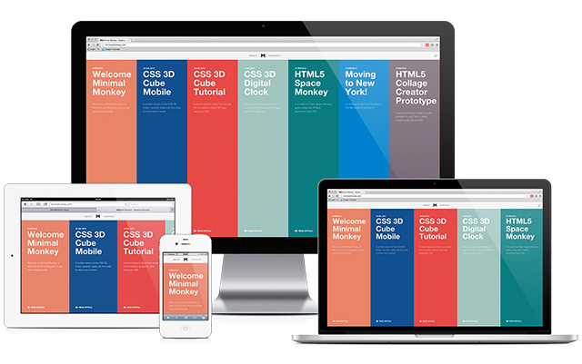

## Minimal Monkey Blog

### Overview

Hello, my name is [Stephen Burgess](https://twitter.com/minimalmonkey) and this repo contains the source code for my site [www.minimalmonkey.com](http://minimalmonkey.github.io/)

### Credits

Created by [Stephen Burgess](https://twitter.com/minimalmonkey) using:

- [Jekyll](http://jekyllrb.com/)
- [Liquid Templating language](http://liquidmarkup.org/)
- [Gulp](http://gulpjs.com/)
- [SASS](http://sass-lang.com/)
- [Browserify](http://browserify.org/)
- [IcoMoon](https://icomoon.io/)
- [and more...](package.json)

Original designs by [Tobias van Schneider](https://twitter.com/schneidertobias)

### License

This software is released under the [MIT license](LICENSE). Go ahead and use it! Have fun. I hope it helps some people learn stuff. Feel free to link back to my [site](http://minimalmonkey.com/), follow me on the [twitters](https://twitter.com/minimalmonkey) (it'll make me feel popular) or if you're really generous buy me a [beer](http://25.media.tumblr.com/bc8dc63e3714bc7dfa694f31195cccfd/tumblr_mkuttrDdLz1s0zc1wo1_500.jpg). Likewise, you can do none of those things, whatever floats your element.
